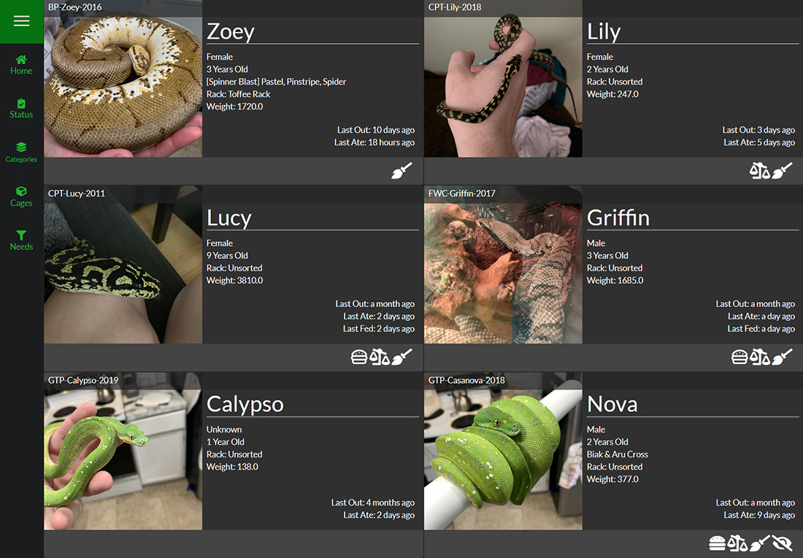

SnekLog is a web based application that was created by a reptile keeper, specifically for other reptile keepers. Since SnekLog is web based, it is available on all platforms and it was built to work on both your large and small screen devices.

It is highly customizable and has many features that may not be obvious at first glance but this guide was built (and is being updated on a regular basis) to help users learn how to use SnekLog to its full potential.

The best part about SnekLog is that it is 100% free with no strings attached. There is no tracking, no sharing of information, no gimmicks, no ads & no premium features. The idea behind SnekLog is that it exists to help keepers take better care of their reptiles so that the reptiles have a better quality of life no matter how small. All that is asked of users is that if they enjoy SnekLog and can spare any change, that you please either support SnekLog though [Patreon](https://www.patreon.com/LongTailReptiles) or [PayPal](https://www.paypal.com/cgi-bin/webscr?cmd=_donations&business=6DGYYCS394CM4&item_name=Developing+%26+Maintaining+SnekLog&currency_code=USD&source=url).

##Navigating the Help Documentation
The sidebar on the left breaks up the documentation into chapters so you can quickly navigate between each function of SnekLog and learn what it does. The documentation also remembers what you have already read and it will place a :fa-check: next to them.