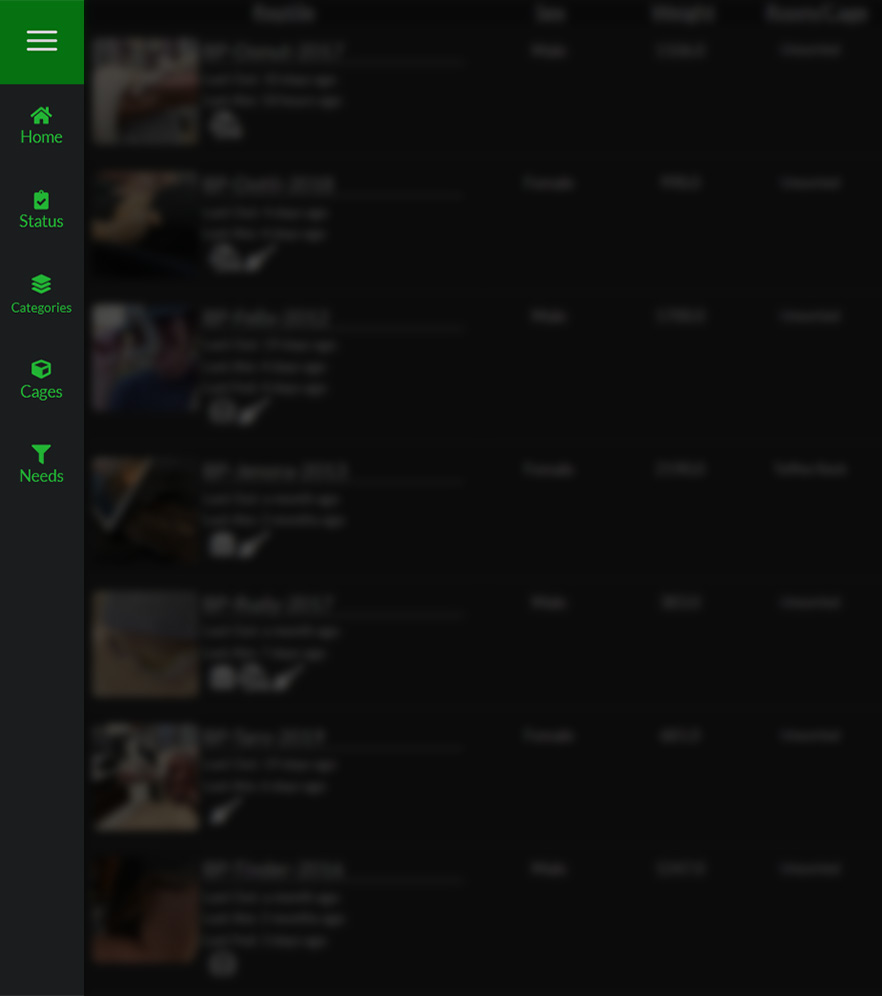
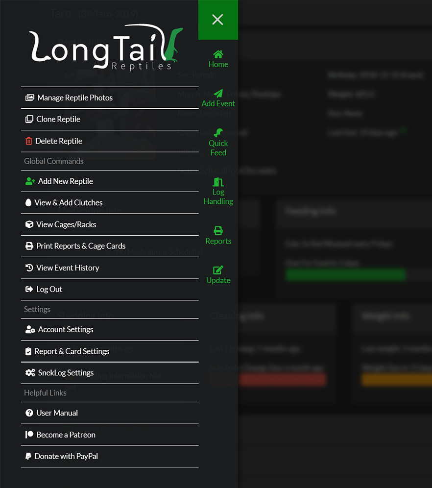

SnekLog's User Interface is broken down into 3 main parts which are commonly referred to throughout the documentation.

##Content Area
The Content Area (or the Main Area) is where most of the work is done and it works exactly like any other web page.

&nbsp;

___

&nbsp;

##Quick Links
The Quick Links bar is on the **left** side of the screen and it is populated with the most commonly used functions on each page. For example, on the [Homepage](https://help.sneklog.com/home-pages) it is where you will find your filters for Reptile Categories & Cages but on the [Reptile Dashboard](https://help.sneklog.com/reptiles/reptile-dashboard) it has a button for "Quick Feed" so you can feed your reptile with 1 click.

&nbsp;

___

&nbsp;

##Sidebar
The Sidebar is accessed by clicking the :fa-bars: icon in the upper left hand corner. The Sidebar is home to somewhat less commonly used functions like [User Settings](https://help.sneklog.com/settings/user-settings). Just like the Quick Links bar, the Sidebar also dynamically updates based on the page you are on with functions that are tied to directly to that page like deleting a Reptile or managing a specific reptile photos.

>>>>>>The Sidebar will also have tips and supplemental information for each page so be sure to check it if you are using the page for the first time.