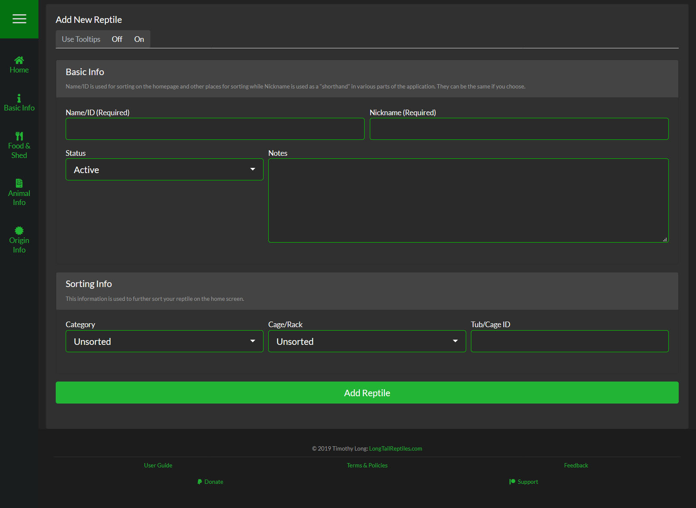

##Basic Info
This is the most essential information to add a reptile to SnekLog. Both Name & Nickname and can be the same thing if you prefer.

####Name/ID
Used as the main method of sorting on the Homepage and when selecting the reptile from a list throughout the application

####Nickname
A more 'user friendly' version of the ID that appears at the top of event pages as well as the Reptile Dashboard

####Status
Status allows you to set your reptile as to following 
* Active (Default)
    * Shows on the Homepage, no extra behavior
* Inactive
    * Hidden from the Homepage by default & marked as "Inactive"
* Quarantine
    * Allows you to set a Start Date as well as a duration and will show a symbol on the Homepage that will change color based on the time set.
* Inactive
    * Hidden from the Homepage by default & marked as "Deceased"
    * You can also set the date the animal passed away to keep on record
* For Sale
    * Marked with a symbol on the Homepage
    * You can also set a Selling Price to keep for your records
* Reserved
    * Marked with a symbol on the Homepage
    * You can also set a information for who the reptile is reserved for to keep for your records
* Sold
    * Hidden from the Homepage by default
    * You can also set a information for who the reptile was sold to for and for how much to keep for your records
* On Loan
    * Hidden from the Homepage by default
    * You can also set a information for who the reptile is On Loan with for your records
     
The different symbols can be seen [here](https://help.sneklog.com/home-pages/home-full/home-full-cards)

####Notes
Notes appear at the top of your Reptile Dashboard and is a convenient place to put important information like behavior quirks or feeding habits

&nbsp;

---

&nbsp;

##Sorting Info
Sorting info is used to help you break up your collection on your Homepage so you don't have to scroll through multiple pages to find the animal you are looking for

####Category
Categories are a useful way to break up a collection by species or any other grouping of your choice
>>>>>> SnekLog comes with a few Species based categories like Ball Python & Green Tree Python, but you can add remove these and add your own through the [Sneklog Settings](https://help.sneklog.com/settings/sneklog-settings/reptile-categories)

####Cage/Rack
Cages & Racks are also a useful way to break up your collection. You can also quickly add events like Feeding & Cleaning to every reptile in a Cage/Rack through the Cages Page. You can add your own Cages/Racks & Rooms in the [Sneklog Settings](https://help.sneklog.com/settings/sneklog-settings/cages-and-rooms)

####Tub/Cage ID
You can put the Tub or Cage ID here for your records
