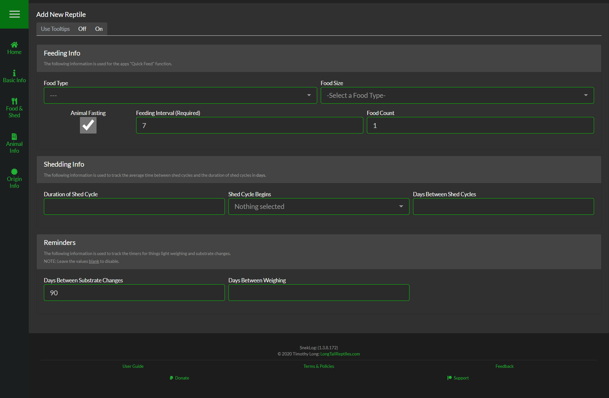

##Food & Shed
This information is used to set defaults for "Quick Feed" event as well as what pre-populates the fields when adding a feeding event normally.

####Food Type
Select from the list of Food Types that come with SnekLog or add your own in the [SnekLog Settings](https://help.sneklog.com/settings/sneklog-settings/events-and-categories).

####Food Size
Once you select a Food Type, the Food Size list will automatically only display related Food Sizes  
IE: A Food Type of Rat Frozen will only show Food Sizes that begin with the word Rat. You can add your own Food Sizes in the [SnekLog Settings](https://help.sneklog.com/settings/sneklog-settings/food-sizes).

####Feeding Interval
The number of days between a Feeding Event logged via 'Quick Feed' and the default value for manually added feeding events.  

####Food Count
The number of Food items the reptile usually eats. This number is also used to calculate Food Weight if you choose to track it.

&nbsp;

---

&nbsp;

##Shedding Info
This information is used to help you estimate when your reptile may go into shed again.

####Duration of Shed Cycle
Enter the average number of days your reptiles Shed Cycle usually lasts.

####Shed Cycle Begins
Select the option you want to start the Duration of the Shed Cycle at. (Pre-Shed or In Shed)

####Days Between Shed Cycles
Enter the average number between each shed cycle for your reptile.

&nbsp;

---

&nbsp;

##Reminders
Other basic but helpful reminders. Just leave them blank if you do not want reminders for each category.

####Days Between Substrate Changes
The number of days you want to go before SnekLog reminds you to do a "Full Substrate Change"

####Days Between Weighing
The number of days you want to go before SnekLog reminds you to weigh your reptile.