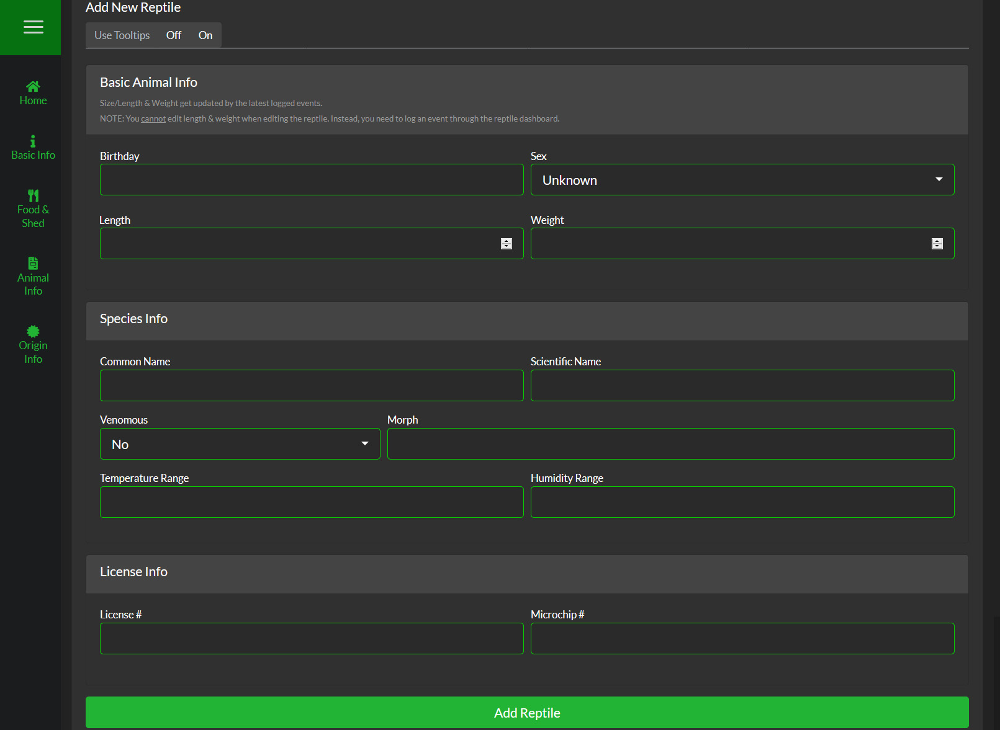

##Basic Animal Info
This information is used in various parts of the application.

####Birthday
Used to keep track of the reptiles age.

####Birthdate Type
Select whether the birthday is "Exact" or "Estimated". It will appear next to the birthday on the [Reptile Dashboard](https://help.sneklog.com/thenest/pages/reptiles/reptile-dashboard)

####Sex
Used to help filter mating and other gender related events.  
IE: If you add a "Mating Event" for a male, only Females & Unknown gender reptiles will show under the list for mates.

####Length
Set the initial Length for the reptile you are adding/cloning.

####Weight
Set the initial Weight for the reptile you are adding/cloning.

>>> Length & Weight can only be changed on this page when you add or clone a reptile. Once you create the reptile, you have to log a Weight or Length event.

&nbsp;

---

&nbsp;

##Species Info
This information is used mainly for your records (and will appear on Cage Cards which are a planned feature in the future).

####Common Name
Common name of the species (Ball Python, Green Mamba, etc).

####Scientific Name
Scientific name of the species (Python regius, Naja kaouthia etc).

####Venomous
(No, Mildly, Venomous) Mildly is intended for Rear-Fanged snakes that typically are not a danger to humans like Hognoses or False Water Cobras.
In a future update this will display a caution icon on the Homepage & Dashboard as well as the Cage Cards.

####Morph
Enter the Morph or Locality of the reptile here.

####Temperature Range
Enter the ideal temperature range here.

####Humidity Range
Enter the ideal humidity range here.

&nbsp;

---

&nbsp;

##License Info
If your reptile has a license or microchip, you can enter the information here for your records.

####License #
Enter the License number here.

####Microchip #
Enter the Microchip number here.