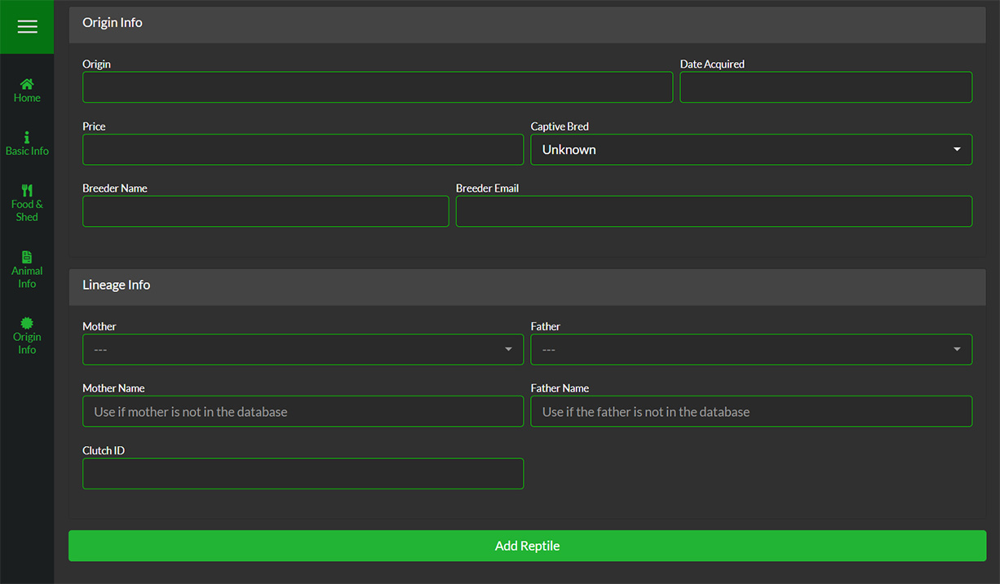

##Origin Info
This information is all related to the animals origin.

####Origin
Enter the expo, store, location or breeder this animal came from.

####Date Acquired
Enter the date you recieved or purchases the animal.

####Price
Enter the price you paid for this animal.

####Captive Bred
You can select whether this animal is 'Captive Bred', 'Wild Caught', or 'Unknown'.

####Breeder Name
Enter the Breeder Name if you want to keep it for your records.

####Breeder Email
Enter the Breeders Email address if you want to keep it for your records.

&nbsp;

___

&nbsp;

##Lineage Info
This information is all related to the animals lineage.

####Mother
If the Mother is in your SnekLog account, you can select it from this list.

####Father
If the Father is in your SnekLog account, you can select it from this list.

>>>>> In the future, you will be able to generate a 'Family Tree' using this information.

####Mother Name
If the Mother is **not** in your SnekLog account, you can just type a name instead for your records.

####Father
If the Father is **not** in your SnekLog account, you can just type a name instead for your records.

####Clutch ID
Enter the ID# of the clutch the animal came from if you want to keep it for your records or put on a Sales Certificate.