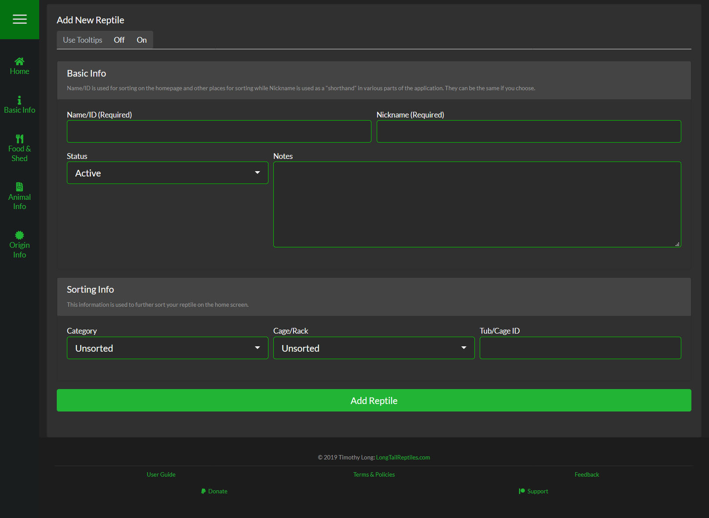

###Overview
This page is what you will use every time you want to Add, Update, and even Clone your reptiles. The information is all broken up into various categoroies that you can either scroll through or use the buttons on the quick-link bar (left side of the screen) to quickly expand & collapse each section.

>>> To add a reptile, the only information you need is a Name, Nickname & Feeding Interval (prefilled at 7 days). The rest of the information is optional and can be added later if you choose.