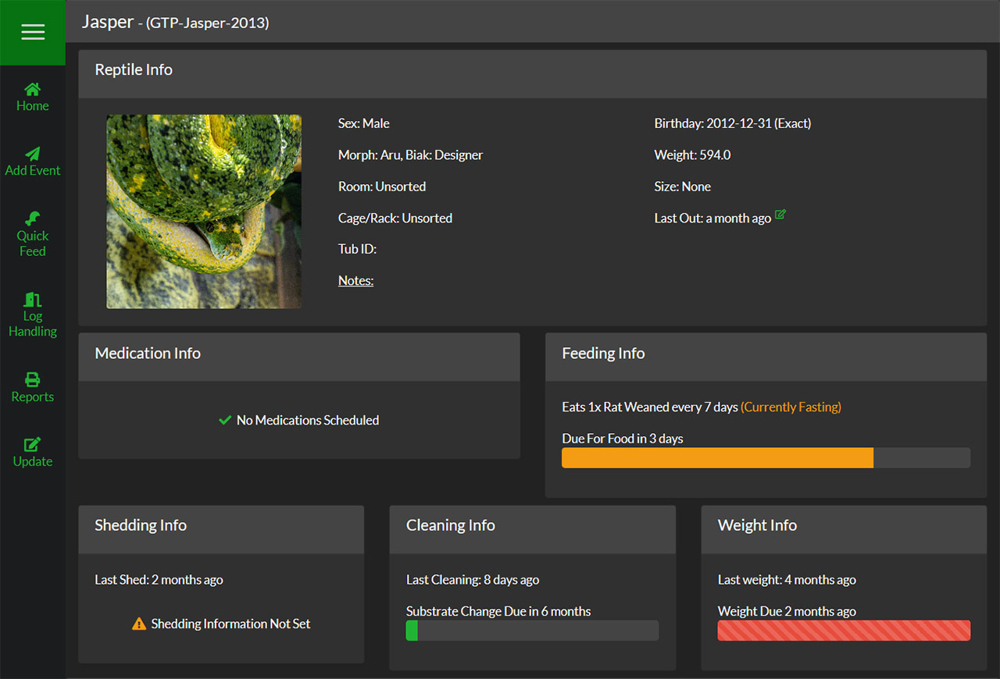

##Overview
The top section of the Reptile Dashboard is home to the basic information of your reptile as well as any upcoming reminders.

####Nickname - (ID)
This box houses the most basic information of the reptile including its weight, length and when it has last out of its enclosure if you choose to log it.

####Medication Info
This box will show any upcoming medications the reptile is due for. You set the reminder when you log a Medication Event with the "Repeat Medication" option selected.

####Feeding Info
This box shows what food and how often this reptile eats.Once you log a Feeding Event, it will count down until the next feeding is due.

####Shedding Info
This box shows the estimated amount of time until the reptile is expected to shed based off values you set when adding the reptile.

####Cleaning Info
This box will count down to remind you when it is time to perform a "Full Substrate Change" of your reptiles enclosure.

####Weight Info
This box will count down to remind you when it is time to weigh your reptile again.

>>>>>> Feeding, Shedding, Cleaning & Weight reminders can all be customized when adding or modifying your reptile You can read more about it [here](https://help.sneklog.com/reptiles/adding-reptile/food-shed).