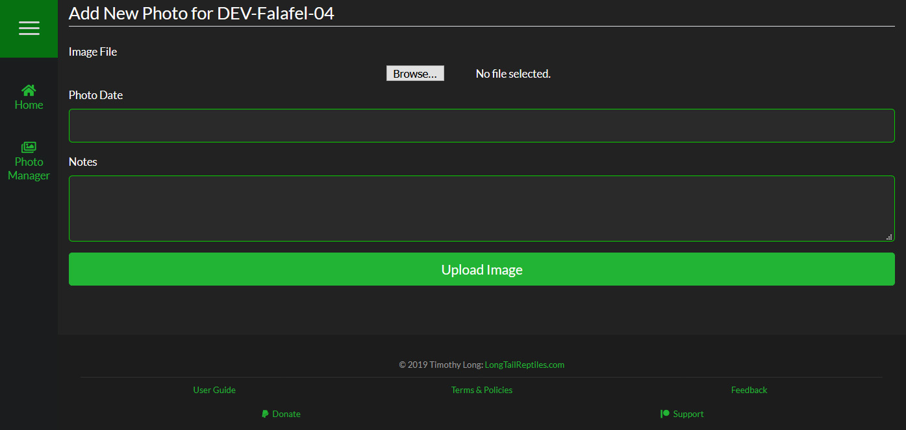

##Overview
To add a photo, simply click "Add Photo" on the quick links bar to be taken to the Add Photo page. This page allows you to select the photo you want to upload and you also have the choice to enter in extra information.

####Image File
Browse your computer or mobile device for a photo you want to upload.

>>> .jpg, .jpeg & .png are the only supported image formats right now. It is planned to add more later.

###Photo Date
Photos are sorted by Newest > Oldest by date so manually adding a date gives you more control over your sort order.

###Notes
Enter any notes related to this image. Notes are displayed at the bottom of the image when viewing it in full-screen mode.