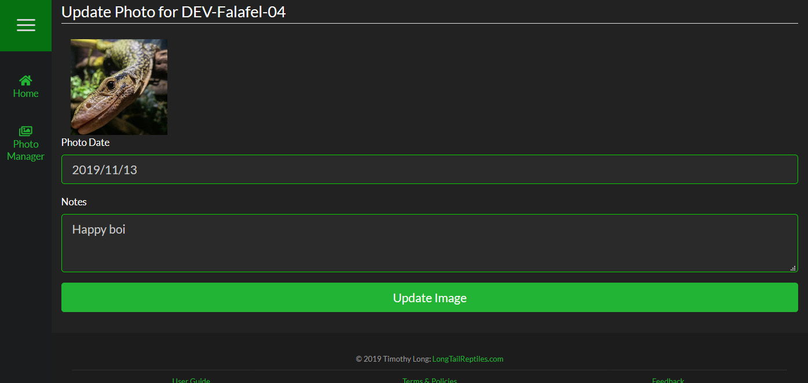

##Overview
To update a photo, simply click "Update Info" under the photo in the Photo Manager. Here you can modify the date and notes for the photo.

>>> You cannot change the photo when updating information.
