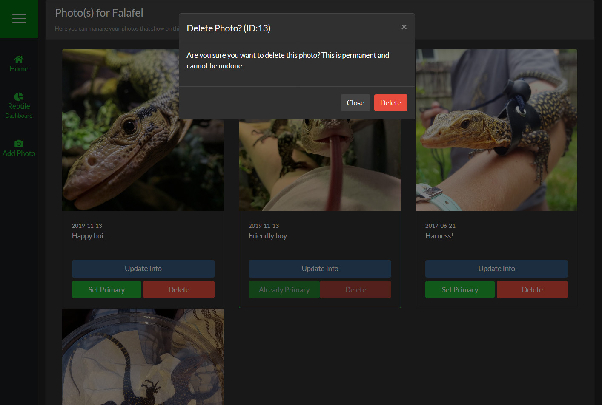

##Overview
To delete a photo, simply click the "Delete" button under the photo on the Photo Manager. You will then be asked to confirm that you want to delete the photo.

>>>> Deleting a photo **permanent** and cannot be undone under any circumstances.

<!--
Separator
-->

>>>>> The photo that is set to "Primary" cannot be deleted. If you want to delete a Primary Photo, you need to set another as Primary first.