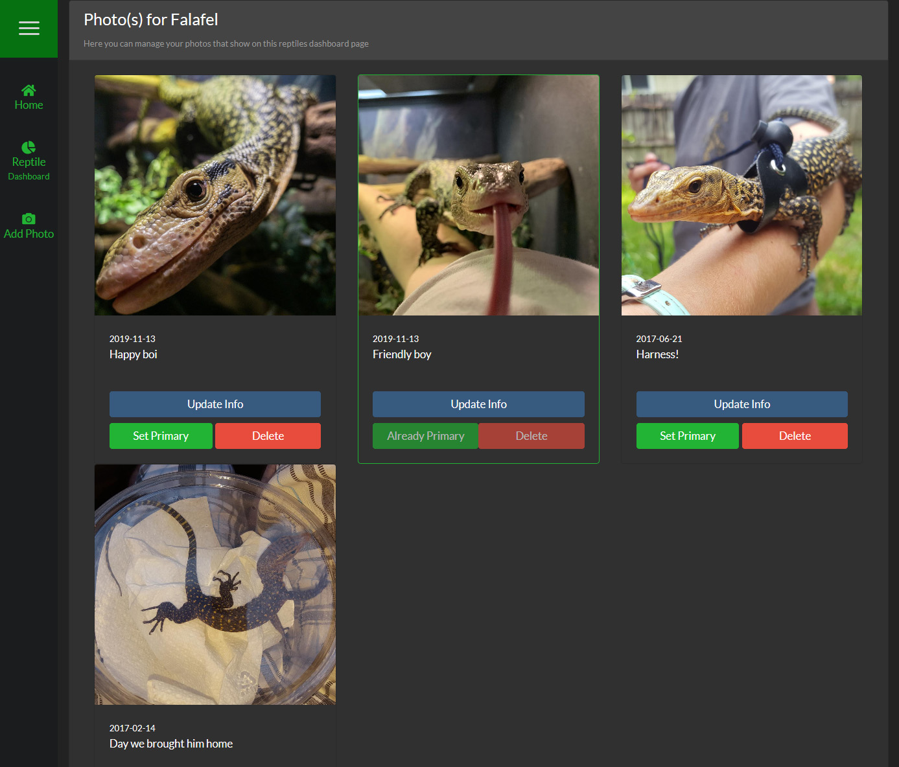

##Overview
The Photo Manager is how you upload, edit & remove photos from your reptiles Photo Gallery. It is also how you set the 'Primary' photo for your reptile that is displayed on the Homepage & Reptile Dashboard.

###Accessing the Photo Manager
To get to the Photo Manager, simply click "Manage Reptile Photos" under the sidebar on the Reptile Dashboard for the reptile you want to manage the photos for.