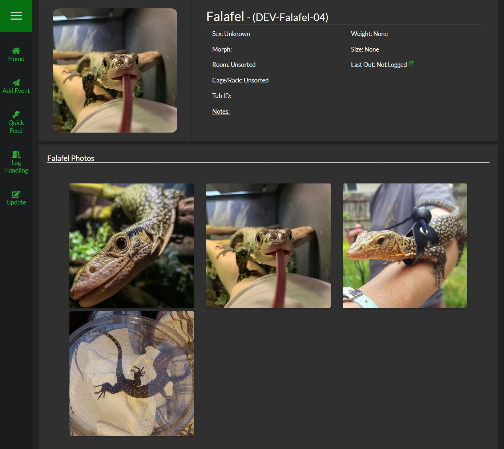

##Photo Gallery
SnekLog allows you to upload up to 10 photos per reptile so you can keep choose to keep visual track of your reptiles or just simply enjoy having pictures close at hand.

###Showing & Hiding the Photo Gallery
The Photo Gallery is hidden by default as to not clutter the screen too much. To show the photo gallery, simply click or tap the profile picture of your reptile and it will expand directly below the picture.

###Full Screen View
Once you see the Photo Gallery, you can simply click or tap on a picture to go into a full-screen view. You can then use the on-screen arrows (or swipe if you are on mobile) between your photos.

>>> Photos are sorted by Newest > Oldest and you can manually set the date when uploading a photo if you choose.

<!--
Seperator
-->

>>>>>> When uploading a photo, any 'Notes' you type in will display at the bottom of the screen when viewing photos in full-screen.