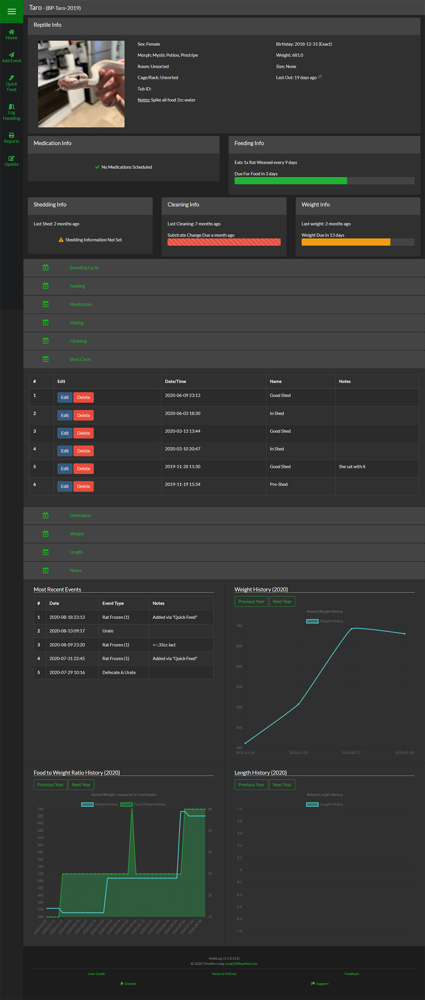

##Overview
This Reptile Dashboard is the core of SnekLog. This is where you keep track of all your reminders and add events for each reptile you add.As the picture above shows, the Dashboard has a lot of information to offer and it can appear overhwelming at first.

>>> To add a reptile, the only information you need is a Name, Nickname & Feeding Interval (prefilled at 7 days). The rest of the information is optional and can be added later if you choose.