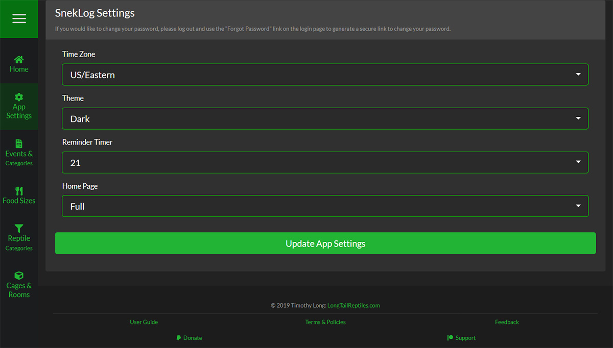

###Overview
The App Settings page holds the most basic of your Application settings like Timezone, Theme, & Reminder Timer as well as your Home Page ([Full](https://help.sneklog.com/home-pages/home-full) or [Compact](https://help.sneklog.com/home-pages/home-compact)) configuration. 

___

<!--
Separator
-->

###Theme
Right now you can choose between a "Dark" and a "Light" theme the app will use when you are logged in. More color palletes are likley to come in future updates.

___

<!--
Separator
-->

###Reminder Timer
The Reminder Timer allows you the change the amount of time before an event is "Due" that the reminder icon appears on the home screen so you can see in advance upcoming events and prepare. The default is 24 hours, but you can choose anywhere between 0-24 in 3 hour increments

>>>>> For Example: By default, If you fed your Reptile on September 1st at 9:00pm with feeding interval of 7 days, the 'Feeding Due' icon will appear an September 6th at 9:01pm.

<!--
Separator
-->

>>>>>> The developer of SnekLog does most of their feeding after sunset and uses 15 hours as their Reminder Timer so they can see who is due for food and pull feeders out in advance the day that a feeding is due.

___

###Home Page
This option allows you to choose which style Home Page you use.

See [Full Size Home](https://help.sneklog.com/home-pages/home-full) or [Compact Home](https://help.sneklog.com/home-pages/home-compact) for details.

>>>>>> You can still use the opposite style at any time by opening the sidebar while on the homepage and selecting the option at the top of the navigation list.