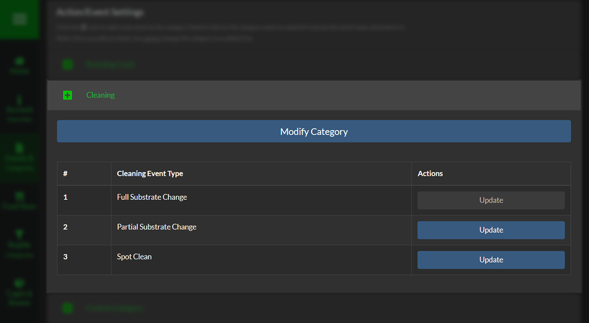
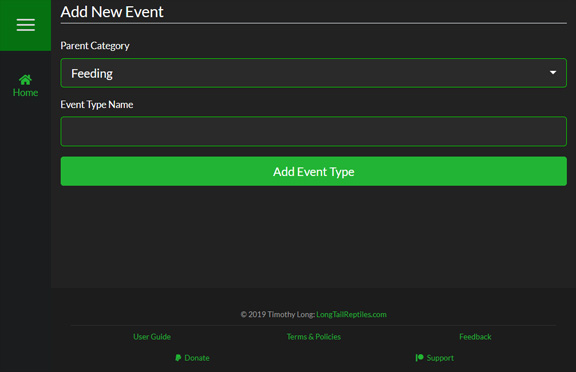
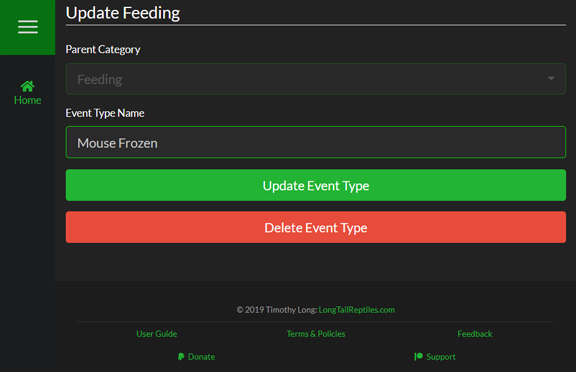
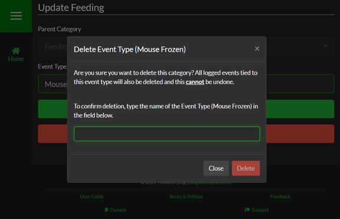

Event Types are assigned to a category and are revealed by clicking on the Category name. They are displayed in a table that is sorted in alphabetical order.

####Adding New Event Types

To add a new Event Type, simply click the "+" icon to the left of the category name you would like to add it to. It will automatically fill the "Parent Category" select list with the category you chose.

>>> Once you add an Event Type you **cannot** change the category it is assigned to so make sure you double check you have the correct Category selected

<!--
Separator
-->

>>>>> Not all Categories can have Event Types added to them, and these Categories have their "+" button disabled.

<!--
Separator
-->

####Updating Event Types

To update an Event Type, click on the "Update" button on the row of the one you want to change. This will also update the name for all the logged events using this Event Type.

>>> Event Types **cannot** be reassigned to other Categories after they are initially created & the select box is disabled when updating Event Types.

<!--
Separator
-->

>>>>> Some Event Types are essential to the functionality of SnekLog and **cannot** be renamed or deleted. You will notice this by the "Update" button being disabled on the settings page.

####Deleting Event Types

If you decide that you want to delete the Event Type, simply quick the "Delete Event Type" button and you will be prompted with a confirmation window. To ensure that no Event Types are delete by accident, you are required to type the Event Type name into the text field in the pop-up to enable to delete button.

>>>Deleting an Event Type will also delete **all** logged events for it.

<!--
Separator
-->

>>>>Deleting an Event Type is a permanent action that **cannot be undone under any circumstances**.