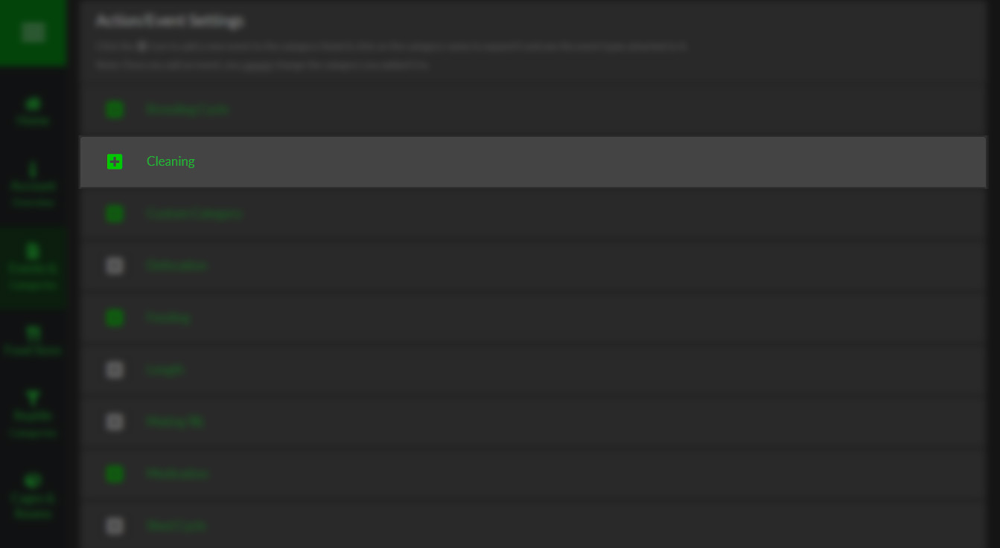
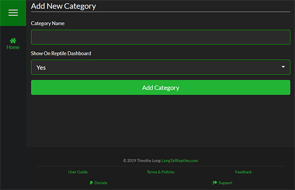
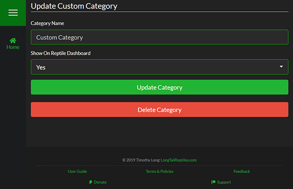

Each Category is represented on this page as a card. You can click on each Category name to expand it to reveal the "Modify Category" button as well as a list of the Event Types assigned to it.

####Adding New Categories

To add a new Category, simply click the "Add New Category" button at the bottom of the page and then enter the name of the Category you want to add.

####Updating Categories

To update a Category, click on the "Modify Category" button just under the Category name when you expand the card. 

>>>>> Some categories are essential to the functionality of SnekLog and **cannot** be renamed or deleted. You will notice this by the "Category Name" text field being disabled and there being no "Delete Category" button on the page.

<!--
Separator
-->

>>>>>> Even though some Categories cannot be deleted, they can be "Hidden" from the Reptile Dashboard by clicking "Modify Category" and selecting the appropriate option.

####Deleting Categories
If you decide that you want to delete the Category, simply quick the "Delete Category" button and you will be promoted with a confirmation window. To ensure that no Category is delete by accident, you are required to type the Category name into the text field in the pop-up to enable to delete button.

>>>Deleting a Category will also delete any Event Types and logged events for it.

<!--
Separator
-->

>>>>Deleting a Category is a permanent action that **cannot be undone under any circumstances**.
