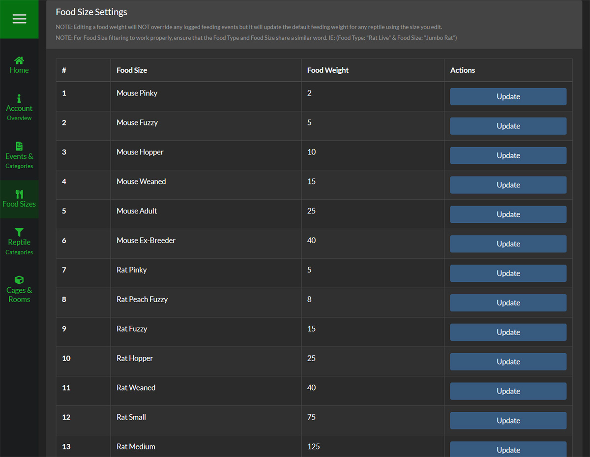
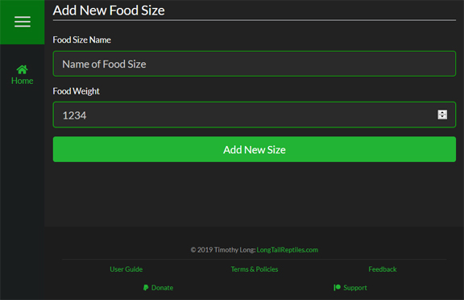
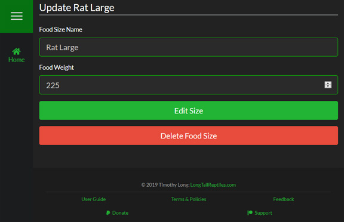
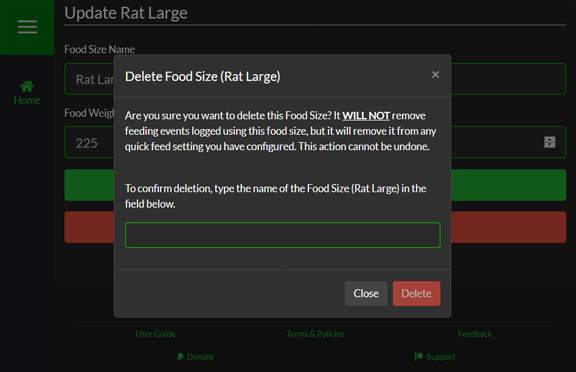

###Overview
Each Food Size is represented on as a row on the table. It sorts alphabetically & by weight so your Food Types (Mouse, Rat, Rabbit) should always be grouped together.

####Adding New Food Sizes

To add a new Food Size, simply click the "Add New Food Size" button at the bottom of the page and then enter the name of the Food Size you want to add.

####Updating Food Sizes

To update a Food Size, click on the "Update" button for the one you would like to change.

>>>>>> Updating a name of a Food Size **will not** overwrite previously logged weights. This is useful if you have an average weight for each category but then change suppliers that have a different average weight for each Food Type.

####Deleting Food Sizes

If you decide that you want to delete the Food Size, simply quick the "Delete Food Size" button, and you will be prompted with a confirmation window. To ensure that no Food Size is delete by accident, you are required to type the name into the text field in the pop-up to enable to delete button.

>>>Deleting a Food Size will **not** delete any logged feeding events or remove any previously logged weights. It will however, remove the Food Size name from the display on the Reptile Dashboard.

<!--
Separator
-->

>>>>Deleting a Food Size is a permanent action that **cannot be undone under any circumstances**.