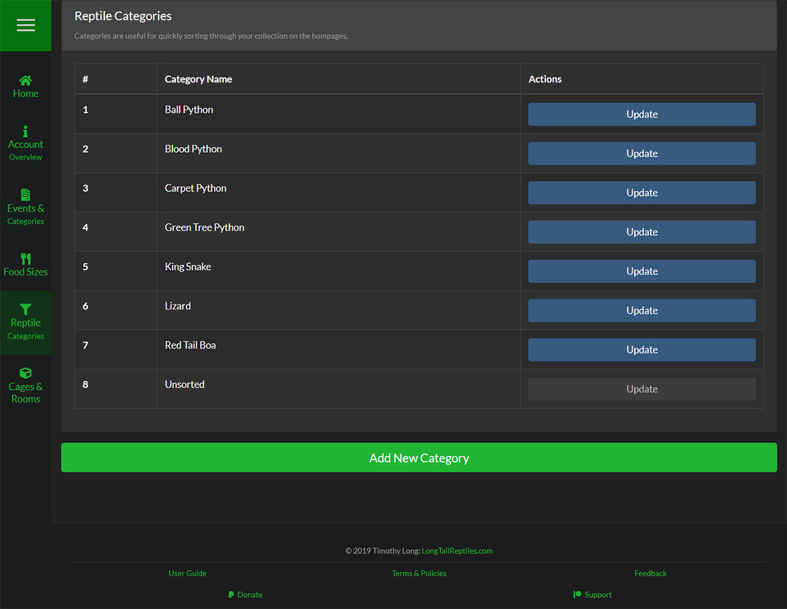
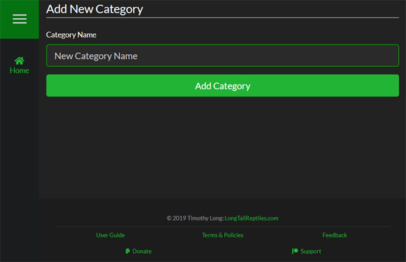
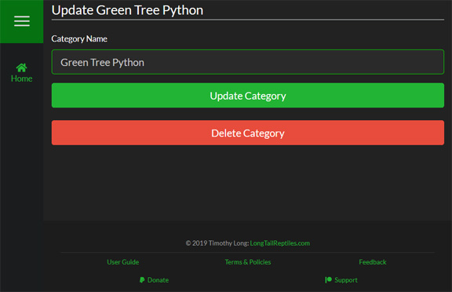
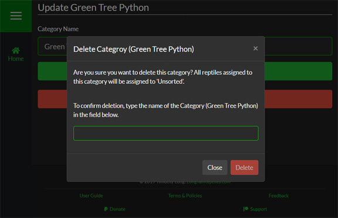

###Overview
Each Reptile Category is represented on as a row on the table and is sorted alphabetically.

####Adding New Reptile Categories

To add a new Reptile Category, simply click the "Add New Reptile Category" button at the bottom of the page and then enter the name of the Reptile Category you want to add.

####Updating Reptile Categories

To update a Reptile Category, click on the "Update" button for the one you would like to change.

####Deleting Reptile Categories

If you decide that you want to delete the Reptile Category, simply quick the "Delete Reptile Category" button, and you will be prompted with a confirmation window. To ensure that no Reptile Category is delete by accident, you are required to type the name into the text field in the pop-up to enable to delete button.

>>>Deleting a Reptile Category will move any reptile in the category to **Unsorted**

<!--
Separator
-->

>>>>Deleting a Reptile Category is a permanent action that **cannot be undone under any circumstances**.