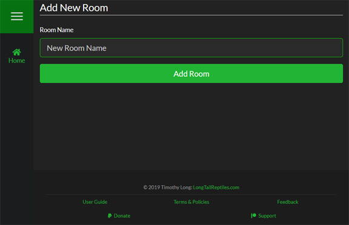

Each Room is represented on this page as a card. You can click on each Room name to expand it to reveal the "Modify Room" button as well as a list of the Cages/Racks assigned to it.

####Adding New Rooms

To add a new Room, simply click the "Add New Room" button at the bottom of the page and then enter the name of the Room you want to add.

####Updating Rooms

To update a Room, click on the "Modify Room" button just under the Room name when you expand the card. 

>>>>> The Room titled "Unsorted" cannot be modified as it is the default Room on your account.

<!--
Separator
-->

####Deleting Rooms

If you decide that you want to delete the Room, simply quick the "Delete Room" button and you will be prompted with a confirmation window. To ensure that no Room is deleted by accident, you are required to type the Room name into the text field in the pop-up to enable to delete button.

>>>>>Deleting a Room will move any Cages in it to the **Unsorted** Room

<!--
Separator
-->

>>>>Deleting a Room is a permanent action that **cannot be undone under any circumstances**.
