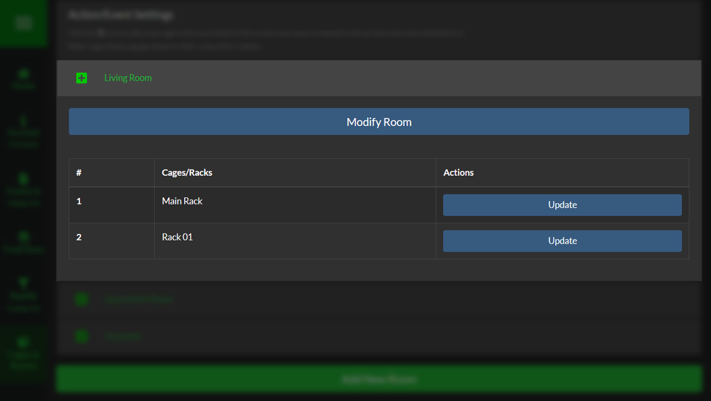
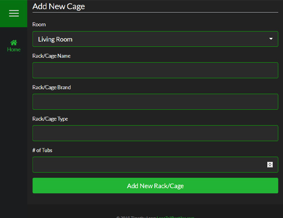
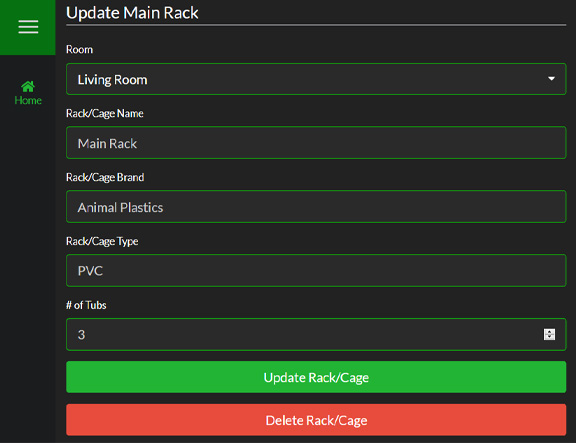

Cages & Racks are assigned to a Room and are revealed by clicking on the Room name. They are displayed in a table that is sorted in alphabetical order.

####Adding New Cages/Racks

To add a new Cage or Rack, simply click the "+" icon to the left of the Room name you would like to add it to. It will automatically fill the "Room" select list with the Room you chose.

>>>>> Cages **can** be reassigned to another Room after creation

####Updating Cages/Racks

To update a Cage or Rack, click on the "Update" button on the row you would like to change.

>>> The "Unsorted" Cage in the "Unsorted" Room **cannot** be edited or deleted

<!--
Separator
-->

>>>>> Updating a Cage/Rack will automatically update all Reptiles assigned to it.

####Deleting Cages/Racks

If you decide that you want to delete the Cage or Rack, simply quick the "Delete Cage/Rack" button and you will be prompted with a confirmation window. To ensure that no Cages/Racks are delete by accident, you are required to type the Cage/Rack name into the text field in the pop-up to enable to delete button.

>>>>>Deleting a Cage/Rack will move any reptiles assigned to it to **Unsorted**

<!--
Separator
-->

>>>>Deleting an Cage/Rack is a permanent action that **cannot be undone under any circumstances**.
