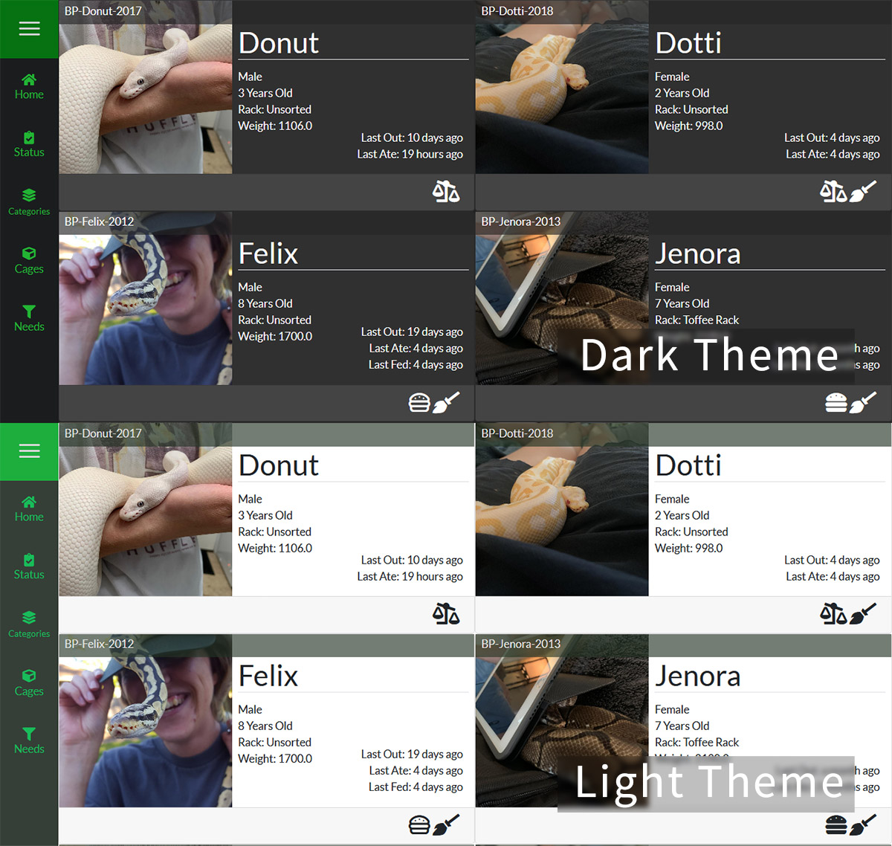

###Global SnekLog Settings
These settings are used by SnekLog as a whole and will effect almost everything you do. 

___

<!--
Separator
-->

###TimeZone
SnekLog stores everything you log in UTC (Coordinated Universal Time) so it is very important that you select the proper Time Zone you are in so that all the conversions are done properly. 

>>>>> If you ever move or change location, simply update your Time Zone and SnekLog will adjust everything for you.

___

<!--
Separator
-->

###Home Page
This option allows you to choose which style Home Page you use.

See [Full Size Home](https://help.sneklog.com/home-pages/home-full) or [Compact Home](https://help.sneklog.com/home-pages/home-compact) for details.

>>>>>> You can still use the opposite style at any time by opening the sidebar while on the homepage and selecting the option at the top of the navigation list.

___

<!--
Separator
-->

###Theme
Right now you can choose between a "Dark" and a "Light" theme the app will use when you are logged in. More color palletes are likley to come in future updates.
