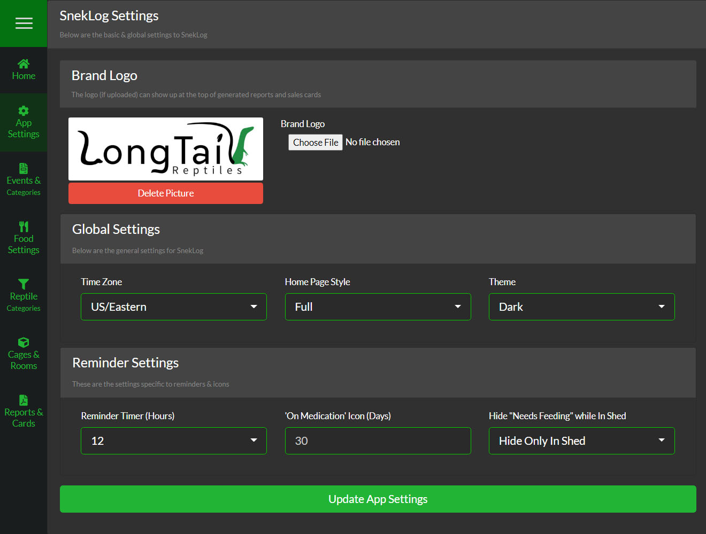

###Overview
The App Settings page holds the most basic of your Application settings like Timezone, Theme, & Reminder Settings as well as your Home Page ([Full](https://help.sneklog.com/home-pages/home-full) or [Compact](https://help.sneklog.com/home-pages/home-compact)) configuration. 