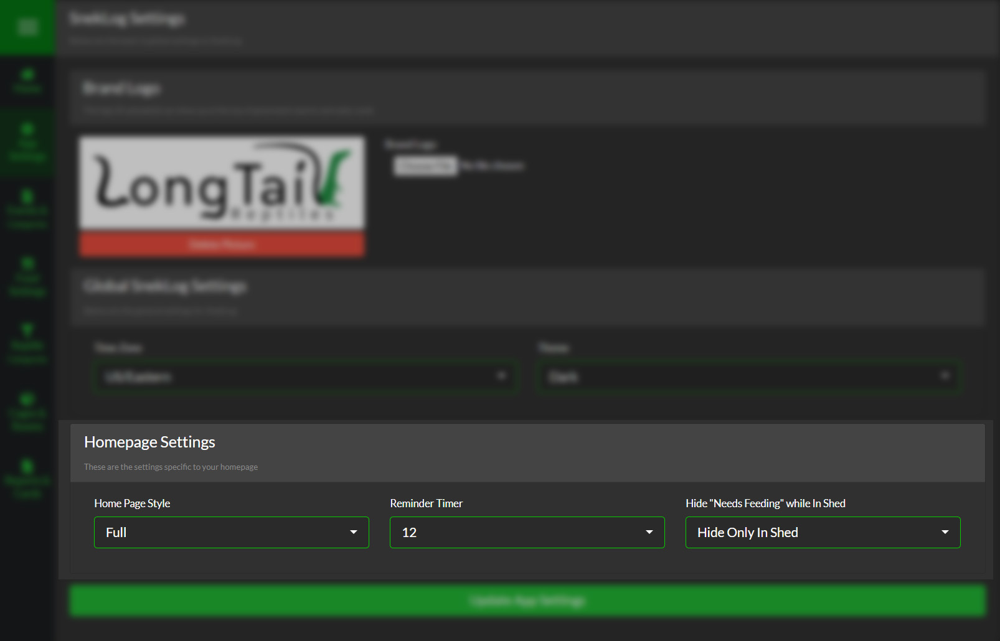

###Reminder Timer
The Reminder Timer allows you the change the amount of time before an event is "Due" that the reminder icon appears on the home screen so you can see in advance upcoming events and prepare. The default is 24 hours, but you can choose anywhere between 0-24 in 3 hour increments

>>>>> For Example: By default, If you fed your Reptile on September 1st at 9:00pm with feeding interval of 7 days, the 'Feeding Due' icon will appear an September 6th at 9:01pm.

<!--
Separator
-->

>>>>>> The developer of SnekLog does most of their feeding after sunset and uses 15 hours as their Reminder Timer so they can see who is due for food and pull feeders out in advance the day that a feeding is due.

___

###Home Page
This option allows you to choose which style Home Page you use.

See [Full Size Home](https://help.sneklog.com/home-pages/home-full) or [Compact Home](https://help.sneklog.com/home-pages/home-compact) for details.

>>>>>> You can still use the opposite style at any time by opening the sidebar while on the homepage and selecting the option at the top of the navigation list.

___

###Hide "Needs Feeding" While in Shed
This option allows hide reptile that are either "In Shed" or that are in "Pre-Shed" from both the Homepage and the Feeding list. This is useful if you don't feed your reptiles while they are going through a Shed Cycle and if you don't want them to show up when you are using the "Needs Feed" filter.

>>>>>> If you have this setting enabled, you will have a notification pop up when applying the "Needs Feeding" filter telling you how many reptiles were hidden from the page.