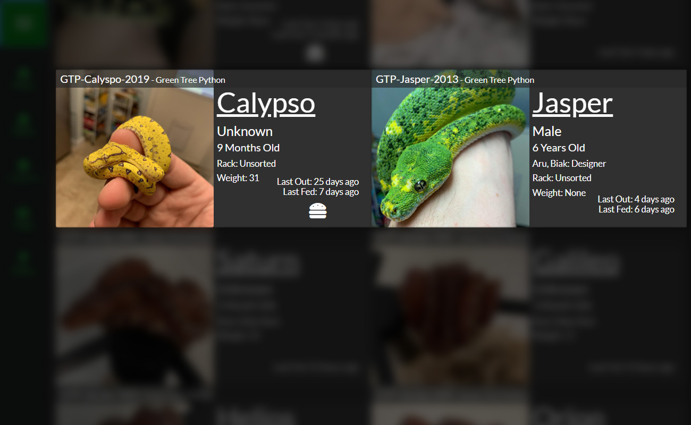

###Overview
Each reptile you add into SnekLog is represented on their own card. Each card shows an overview of the reptiles information such as their ID, Nickname, Age as well as when they were last fed and handled (if you keep track of handling) as well as reminders. Depending on the size of your screen different information will be displayed.

Cards are ordered alphabetically by ID number so if you use a designation for species like "BP-" or "GTP-" they will automatically be grouped together when scrolling.

>>>>> This size of your screen will determine how much information is shown. Mobile & small screen devices show a more compact version of the home screen but will still show at least the ID, Nickname, Last Handled & Fed, as well as any reminders.

 

###Reminders
Reminders are the little icons you will see under the "Last Fed" text. Each icon represents as status.

| Icon 	| Status |
| ------ | ----------- |
|       		| Due for Food |
|       				| Status set to "Fasting" & is NOT due for food |
|    | Due for Weight Check |
|    				| Due for Cleaning |
|      			| Due for Medication |
|      		| In "Pre-Shed" |
|      		| In "Shed" |
|       	| Status set to "Reserved" |
|       		| Status set to "For Sale" |
|       		| Status set to "Quarantine"   White: No Quarantine Duration set   Orange: Timer set and it's prior to the duration   Green: Timer is set and the duration is past |

Icons are provided by of <a href="https://fontawesome.com/license">Font Awesome</a>

Reminder icons are triggers by a customizable "Reminder Timer" value you can set in your "Account Settings" and they will only appear if the 'event due' time is less than the reminder timer. This way, you can see in advance when an event like a feeding is due so you can prepare all your feeder items in advance.

>>>>>> You can set the amount of time before the event is due that the icon shows up on the homepage under your 
"Account Settings" (Default is 24 hours).

<!--
Separator
-->

>>>>> IE: By default, If you fed your Reptile on September 1st at 9:00pm with feeding interval of 7 days, the 'Feeding Due' icon will appear an September 6th at 9:01pm.

